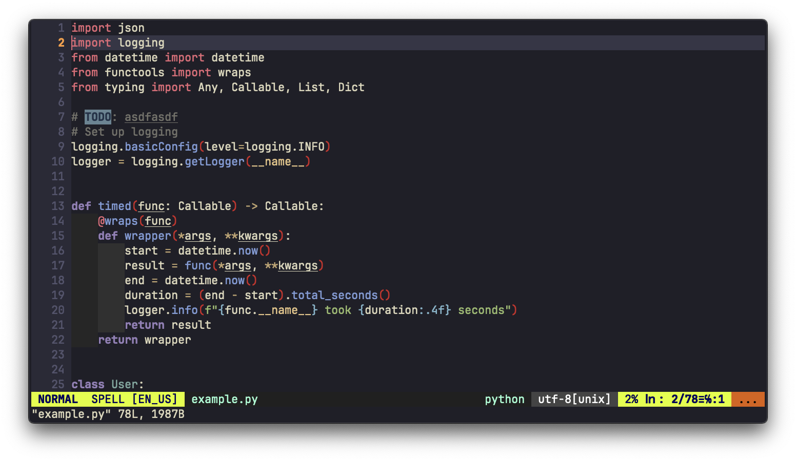

# Kanagawa.vim

A modern and smooth [Kanagawa.nvim](https://github.com/rebelot/kanagawa.nvim)-inspired colorscheme for Vim.  
Mimics the wave variant of the Kanagawa palette. Requires true-color support.



## Installation

### With [vim-plug](https://github.com/junegunn/vim-plug)

```vim
Plug 'menisadi/kanagawa.vim'
```

Then restart Vim and run `:PlugInstall`.

### With [Vundle](https://github.com/VundleVim/Vundle.vim)

```vim
Plugin 'menisadi/kanagawa.vim'
```

Then restart Vim and run `:PluginInstall`.

### With [Pathogen](https://github.com/tpope/vim-pathogen)

```bash
cd ~/.vim/bundle
git clone https://github.com/menisadi/kanagawa.vim
```

### Manual Installation

1. Download or clone this repository.
2. Copy (or symlink) the `colors/kanagawa.vim` file to your `~/.vim/colors` directory.

## Usage

In your `.vimrc` (or `init.vim`):
```vim
set termguicolors
colorscheme kanagawa
```

## Recommended Tmux Settings

If you’re using Tmux, ensure you’re using true-color overrides:

```
set -g default-terminal "xterm-256color"
set -ga terminal-overrides ",xterm-256color:Tc"
```

## Credits

- [kanagawa.nvim](https://github.com/rebelot/kanagawa.nvim) by [rebelot](https://github.com/rebelot) (inspiration & palette).
- [vim docs on colorschemes](https://vimhelp.org/syntax.txt.html#%3Acolorscheme).

## License

[MIT License](LICENSE).
